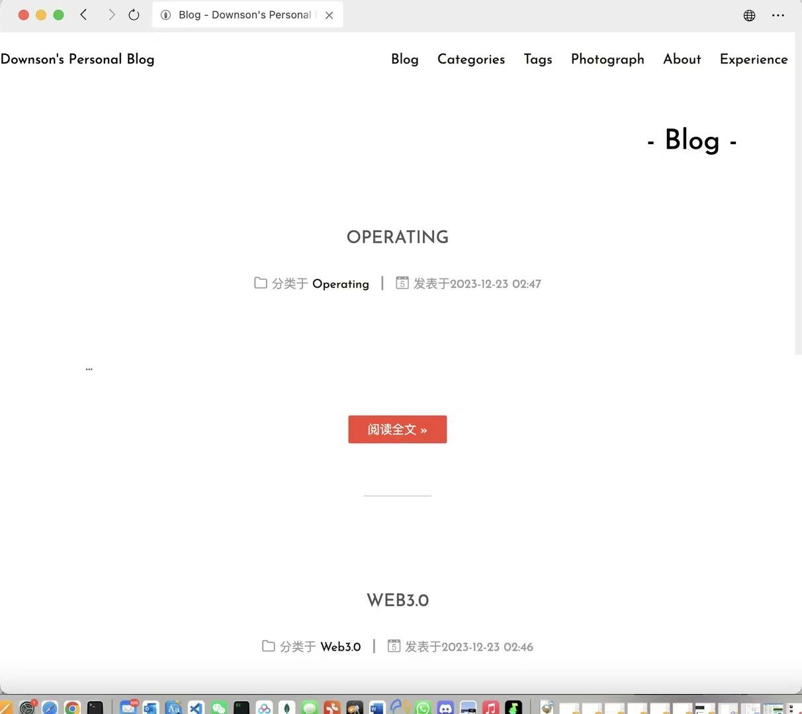

# My Blog Post 
```
.
├── conf
├── controller
├── docs
│   ├── assets
│   ├── content
│   │   ├── Algorithms
│   │   ├── Backend
│   │   ├── Database
│   │   ├── Emotion
│   │   ├── Frontend
│   │   ├── Games
│   │   ├── NBA
│   │   ├── Programming
│   │   ├── Science
│   │   ├── Technology
│   │   ├── Thinking
│   │   └── Web3
│   └── extra_nav
│       └── Thinking
├── images
├── models
├── public
│   ├── css
│   ├── fonts
│   ├── img
│   └── js
├── route
├── utils
├── vendor
│   ├── github.com
│   │   ├── bytedance
│   │   │   └── sonic
│   │   │       # ... (省略)
│   │   ├── chenzhuoyu
│   │   │   └── base64x
│   │   # ... (省略)
│   └── gopkg.in
│       └── yaml.v3
└── views
    └── layouts
```

# 项目文件夹结构

以下是项目的文件夹结构及其各自的作用：

## `conf`

包含配置文件和设置。

## `controller`

存放控制器（Controller）代码，负责处理请求和相应的逻辑。

## `docs`

项目文档和额外资源的存放地。

- `assets`: 存储文档所需的静态资源。
- `content`: 包含各种文档内容，按主题分类。
  - `Algorithms`: 包含算法相关文档。
  - `Backend`: 后端开发相关文档。
  - ...
- `extra_nav`: 存放额外的导航文件，例如关于“Thinking”的额外导航。

## `images`

存储项目中使用的图片资源。

## `models`

包含数据模型和数据库相关代码。

## `public`

用于存放公共资源，如样式表（CSS）、字体（fonts）、图片（img）、JavaScript 文件（js）等。

## `route`

存储路由配置和相关代码。

## `utils`

包含项目中使用的工具类和辅助函数。

## `vendor`

第三方依赖包的存放地。

- `github.com`: 存储 GitHub 上的依赖包。
- `gopkg.in`: 存储使用 gopkg.in 域名的依赖包。

## `views`

存储视图文件，用于前端展示。

- `layouts`: 包含布局文件。


## config.json 配置非常重要!!!

- **port**: The port on which the server listens.
- **pageSize**: The number of articles per page on the homepage.
- **descriptionLen**: When an article does not have a configured "description" field, the default number of words from the article content to be used as the description.
- **author**: The author of the blog, displayed at the bottom of the website.
- **icp**: The record number of the website.
- **webHookSecret**: The key for the webhook that updates blog articles; it should match the key set in your repository.
- **categoryDisplayQuantity**: On the category page, the maximum number of articles to display under each category.
- **tagDisplayQuantity**: On the Tag page, the maximum number of articles to display under each tag.
- **utterancesRepo**: Whether to enable Utterances comments. Leave empty for no comments, or specify the repository name/repo where comments will be stored.
- **timeLayout**: The format for parsing time; keep it the same as the "date" field in your articles unless you understand Golang time parsing.
- **siteName**: The name of the website.
- **documentGitUrl**: The git address of your articles. The application will clone articles in the current directory. It must be public and end with .git.
- **htmlKeywords**: HTML keywords for the webpage.
- **htmlDescription**: HTML description for the webpage.
- **themeColor**: The theme color of the blog.
- **dashboardEntrance**: The access path to the website dashboard. Leave it empty to use /admin.
- **themeOption**: The selectable theme colors for the website.

## Views



